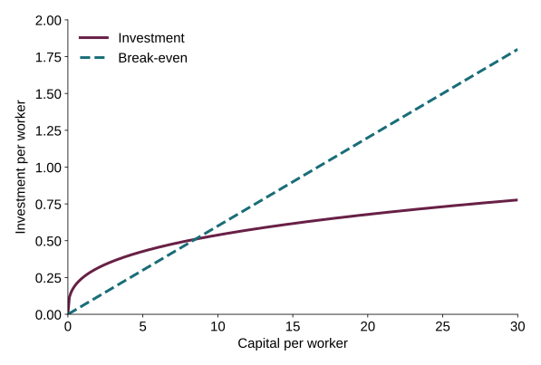
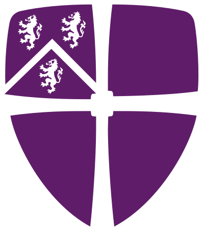

## A slide can still be simple {#simple .teaching-slide}

::: {.eyebrow}
THE QUESTION
:::

::: {.big-question}
Why do some economies have more capital per worker?
:::

- Investment adds to the capital stock.
- Depreciation wears it down.
- A growing workforce spreads capital across more workers.

::: {.takeaway}
Start with the economic idea. Add detail when it helps explain it.
:::

## From an idea to an equation {#equation .equation-slide}

Output per worker is $y$, capital per worker is $k$, and $s$ is the saving rate.
Capital depreciates at rate $\delta$; the workforce grows at rate $n$.

$$
y = k^{1/3}, \qquad \dot{k} = sk^{1/3} - (\delta+n)k
$$

::: {.columns}
::: {.column width="50%"}
### Investment

A share $s$ of output becomes new capital.
:::
::: {.column width="50%"}
### Break-even investment

Replace worn-out capital and equip new workers.
:::
:::

::: {.takeaway}
At the positive steady state, investment exactly covers break-even investment.
:::

::: {.source}
Illustrative continuous-time Solow model; productivity is normalised to one and there is no technological progress.
:::

## Put code beside its result {#code .code-slide}

::: {.columns}
::: {.column width="48%"}

```python
import numpy as np
import matplotlib.pyplot as plt

k = np.linspace(0, 30, 301)
investment = 0.25 * np.cbrt(k)
break_even = 0.06 * k

plt.plot(k, investment,
         label="Investment")
plt.plot(k, break_even,
         label="Break-even")
plt.xlabel("Capital per worker")
plt.legend()
plt.show()
```

:::
::: {.column width="52%"}

:::
:::

::: {.source}
A Python example using Quarto's [code-and-output layout](https://quarto.org/docs/presentations/revealjs/#code). The figure is included in the download; rebuilding the slides does not require Python.
:::

## What happens if we save more? {#solow .solow-slide}

Move the saving rate. Predict the direction before looking at the new steady state.



::: {.source}
Illustrative model: $y=k^{1/3}$, $\delta=0.05$, $n=0.01$, no technological progress. The axes stay fixed as you change $s$.
:::

## Give students time to think {#question .question-slide}

::: {.eyebrow}
DISCUSS WITH A NEIGHBOUR
:::

::: {.big-question}
Does a higher saving rate mean a permanently higher growth rate?
:::

```{=html}
<details class="answer"><summary>Reveal the explanation</summary><p><strong>In this model, no.</strong> Capital and output per worker grow during the transition to a higher steady-state level. Their growth rates then return to zero.</p><p>A higher level is different from a permanently higher growth rate.</p></details>
```

::: {.source}
This answer stays available for revision. Use the button with a mouse, or focus it and press Enter.
:::

## This is what you edit {#source .teaching-slide}

::: {.columns}
::: {.column width="52%"}

````markdown
## Investment and growth

- Investment adds to capital.
- Depreciation wears it down.

$$
\dot{k} = sk^{1/3} - (\delta+n)k
$$
````

:::
::: {.column width="48%"}
### A small text file

`##` starts a new slide. Write your text, add figures and include equations.

Quarto turns the `.qmd` source into a presentation that opens in a browser.
:::
:::

::: {.takeaway}
Want to start with existing slides? Give the Durham slide skill your PowerPoint or Beamer file and ask for a first conversion.
:::

::: {.source}
See [Quarto's slide guide](https://quarto.org/docs/presentations/revealjs/) and [interactive examples](https://quarto.org/docs/interactive/ojs/). The next three slides reuse animations from my teaching.
:::

## Three countries, three goods {#three-goods .framework-slide}



::: {.notes}
From Macro Applications. Home imports good 1; Partner imports good 2; the rest of the world imports good 3. Play highlights each good; Next good advances manually; Show all restores the full static diagram.
:::

## Find your college {#find-your-college .college-slide}

```{=html}
<ul class="college-cloud" aria-label="Durham colleges" data-motion-state="settled">
<li class="college-name" style="--x:14%;--y:14%"><span>Collingwood</span></li>
<li class="college-name" style="--x:38%;--y:14%"><span>Grey</span></li>
<li class="college-name" style="--x:62%;--y:14%"><span>Hatfield</span></li>
<li class="college-name" style="--x:86%;--y:14%"><span>John Snow</span></li>
<li class="college-name" style="--x:14%;--y:38%"><span>Josephine Butler</span></li>
<li class="college-name" style="--x:38%;--y:38%"><span>South</span></li>
<li class="college-name" style="--x:62%;--y:38%"><span>St Aidan's</span></li>
<li class="college-name" style="--x:86%;--y:38%"><span>St Chad's</span></li>
<li class="college-name" style="--x:14%;--y:62%"><span>St Cuthbert</span></li>
<li class="college-name" style="--x:38%;--y:62%"><span>St Hild &amp; St Bede</span></li>
<li class="college-name" style="--x:62%;--y:62%"><span>St John's</span></li>
<li class="college-name" style="--x:86%;--y:62%"><span>St Mary's</span></li>
<li class="college-name" style="--x:14%;--y:86%"><span>Stephenson</span></li>
<li class="college-name" style="--x:38%;--y:86%"><span>Trevelyan</span></li>
<li class="college-name" style="--x:62%;--y:86%"><span>University</span></li>
<li class="college-name" style="--x:86%;--y:86%"><span>Van Mildert</span></li>
</ul>
<div class="induction-motion-controls"><button type="button" data-action="replay-colleges">Play / replay</button><button type="button" data-action="pause-motion" disabled>Pause</button><button type="button" data-action="arrange-colleges">Arrange now</button></div>
```

## Durham Intercollegiate Champions! {#champions-2026 .champions-slide}

```{=html}
<div class="champions-stage" data-motion-state="settled"><div class="champions-fireworks" aria-hidden="true"></div></div>
<div class="induction-motion-controls champions-controls"><button type="button" data-action="replay-champions">Celebrate</button><button type="button" data-action="pause-motion" disabled>Pause</button><button type="button" data-action="stop-champions">Stop fireworks</button></div>
```

::: {.notes}
An example of the celebration used in the induction presentation. Use the button to play; the static shield remains visible for revision and reduced-motion preferences.
:::
